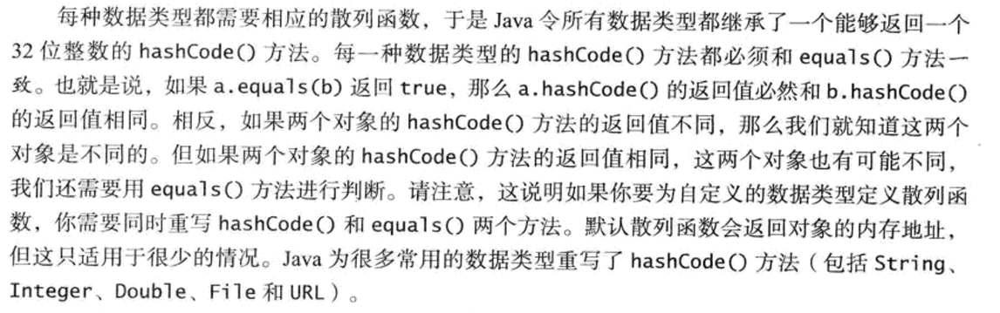

# Java数据结构与算法

# 一.背包，队列与栈

## 动态数组：

元素容量达到数组大小自动扩容为2倍，元素数量小于1/4，自动缩容为1/2

对于动态数组平均摊销为O(1):

加入初始元素为1且大小为1，第一次添加就需要扩容，扩容数量为2n，添加次数为n，平均为O(1)

API:

```java
public class ArrayList<Item> implements Iterable<Item>
{
		ArrayList() //空数组
		add() //添加元素，可新建add实现指定位置添加
		capacity() // 现在数组元素个数
		size() // 数组容量大小
		remove() //移除元素，同add
		clear() // 删除所有元素
		get() // 获取指定索引元素
		resize() // 扩容，缩容
}
```

## 链表

一种递归的数据结构

代码结构：

```java
private class Node
{
	Item item
	Node next
}
```

哨兵节点sentinel：在链表头出定义哨兵节点sentinel，数据域不使用，指针域指向空；对于空链表判断为哨兵节点后有无指针；增添元素直接从哨兵节点后开始；循环时保证一个实际永久存在指针作为索引起点

## 背包：

1.背包不支持从中删除元素的数据类型，目的是帮助用例手机元素并迭代遍历的所有收集到的元素。

2.API: 

```java
public class Bag<Item> implements Iterable<Item>
				Bag()  //创建空背包
		void add(Item item) // 添加一个元素
		boolean isEmpty() // 背包是否为空
		int size() // 背包中的元素数量
```

3.特殊背包：随即背包：一般指的是随即背包问题，一种优化方法

## 队列

1.先进先出，foreach处理元素的顺序就是元素进入队列的顺序

2.API：

```java
public class Queue<Item> implements Iterable<Item>
	Queue() // 新建空队列
	void enqueue(Item item) //添加元素
	Item dequeue() // 删除元素
	boolean isEmpty() //检查为空
	int size() //大小
	
```

3.特殊队列：双向队列

API：

```java
public class Deque<Item> implements Iterable<Item>
	Deque() // 新建空队列
	void pushhLeft()
	void pushRight()
	Item popLeft()
	Item popRight()
	boolean isEmpty() //检查为空
	int size() //大小
```

无直接实现类，是一个接口，可以实现数组，链表，优先级等，在应用时需要使用arraylist或者linkedlist。

## 栈

1.后进后出

2.API：

```java
public class Stack<Item> implements Iterable<Item>
	Stack()
	void push(Item item)
	Item pop()
	boolean isEmpty()
	int size()
```

有直接实现类Stack

## 散列表

用键作为数组的索引，以求快速访问数组值

散列函数：将键转换成数组索引的函数

java中的一些约定：



拉链法：依靠链表，依靠哈希函数先找到数组索引，再在数组中存的这个链表中寻找

线性探测法：查找索引，如果被占用，就顺位查找下一个；涉及删除操作：当删除某个值的时候，要将这个值右侧所有值重新插入数组，删除元素处不能设定为Null，设计为deleted类似的墓碑标记。

Hash Set（）：不在意value，一律设为Object present，只在乎key，可以有效实现去重

为什么hashmap需要实现扩容：避免hash冲突，减少链表的遍历

# 二.排序

## **📊 经典排序算法全方位对比表**

| **选择排序** | 每轮挑**最小**的放前面，交换次数最少 |
| --- | --- |
| **插入排序** | 像**理扑克牌**，新牌插入已排好的位置 |
| **归并排序** | **分半 → 分别排 → 合并**，稳定但费内存 |
| **快速排序** | **选基准 → 切分 → 递归**，实际最快但怕有序 |

| **排序算法** | **最好时间复杂度** | **平均时间复杂度** | **最坏时间复杂度** | **空间复杂度** | **稳定性** | **适用场景** |
| --- | --- | --- | --- | --- | --- | --- |
| **选择排序** | O(n²) | O(n²) | O(n²) | O(1) | ❌ 不稳定 | 数据量极小（n < 50）或对交换次数有严格要求时 |
| **插入排序** | **O(n)** | O(n²) | O(n²) | O(1) | ✅ 稳定 | 数据**基本有序**；小规模数据（n < 15-20）作为高级排序的底层层 |
| **希尔排序** | O(n log n) ~ O(n^1.3) | O(n^1.3~1.5) | O(n²) | O(1) | ❌ 不稳定 | 中等规模数据，要求**原地排序**且对稳定性无要求 |
| **归并排序** | O(n log n) | O(n log n) | O(n log n) | **O(n)** | ✅ 稳定 | 数据量大且**要求稳定**；**链表排序**（可O(1)空间）；外部排序 |
| **快速排序** | O(n log n) | O(n log n) | **O(n²)** | O(log n) | ❌ 不稳定 | **通用工程场景**（实际最快）；配合随机化pivot和插入排序优化 |
| **堆排序** | O(n log n) | O(n log n) | O(n log n) | O(1) | ❌ 不稳定 | 内存受限；需要**实时获取最值**（优先队列）；**Top-K**问题 |
| **计数排序** | O(n + k) | O(n + k) | O(n + k) | O(k) | ✅ 稳定 | 整数且**数据范围 k 不大**（如年龄、分数） |
| **桶排序** | O(n + k) | O(n + k) | O(n²) | O(n + k) | ✅ 稳定（取决于桶内排序） | 数据**均匀分布**（如浮点数） |
| **基数排序** | O(d(n + k)) | O(d(n + k)) | O(d(n + k)) | O(n + k) | ✅ 稳定 | 整数或**定长字符串**（如身份证号、电话号码） |

## **🎯 实际工程选型速查（按优先级）**

| **你的需求** | **首选算法** | **备选** | **说明** |
| --- | --- | --- | --- |
| **通用排序（数组）** | 快速排序 | 归并排序 | 快排实测最快，但要注意最坏情况 |
| **要求稳定** | 归并排序 | 插入排序（n小） | 归并是稳定排序中效率最高的 |
| **内存紧张** | 堆排序 | 希尔排序 | 堆排序原地排序，只占 O(1) |
| **数据基本有序** | 插入排序 | — | 插入排序在有序情况下 O(n)，极致快 |
| **整数且范围小** | 计数排序 | 基数排序 | 线性时间，但空间换时间 |
| **链表排序** | 归并排序 | — | 归并对链表友好，无需额外数组空间 |
| **海量数据外部排序** | 归并排序 | — | 多路归并是外部排序的标准做法 |
| **实时 Top-K** | 堆排序 | 快速选择 | 堆可动态维护 Top-K |