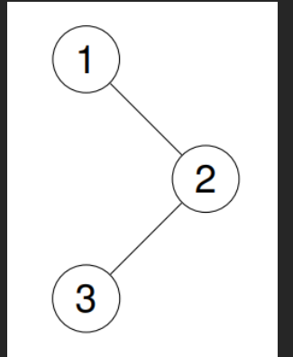

# Leetcode 练习笔记

### 232.用栈实现队列

请你仅使用两个栈实现先入先出队列。队列应当支持一般队列支持的所有操作（`push`、`pop`、`peek`、`empty`）：

实现 `MyQueue` 类：

- `void push(int x)` 将元素 x 推到队列的末尾
- `int pop()` 从队列的开头移除并返回元素
- `int peek()` 返回队列开头的元素
- `boolean empty()` 如果队列为空，返回 `true` ；否则，返回 `false`

**说明：**

- 你 **只能** 使用标准的栈操作 —— 也就是只有 `push to top`, `peek/pop from top`, `size`, 和 `is empty` 操作是合法的。
- 你所使用的语言也许不支持栈。你可以使用 list 或者 deque（双端队列）来模拟一个栈，只要是标准的栈操作即可。

**示例 1：**

```
输入：
["MyQueue", "push", "push", "peek", "pop", "empty"]
[[], [1], [2], [], [], []]
输出：
[null, null, null, 1, 1, false]

解释：
MyQueue myQueue = new MyQueue();
myQueue.push(1); // queue is: [1]
myQueue.push(2); // queue is: [1, 2] (leftmost is front of the queue)
myQueue.peek(); // return 1
myQueue.pop(); // return 1, queue is [2]
myQueue.empty(); // return false
```

**提示：**

- `1 <= x <= 9`
- 最多调用 `100` 次 `push`、`pop`、`peek` 和 `empty`
- 假设所有操作都是有效的 （例如，一个空的队列不会调用 `pop` 或者 `peek` 操作）

代码：

```java
/*
	先进后出实现先进先出需要两个栈，一个入栈一个出栈，入栈保证队列末尾添加元素，
	出栈保证队首出元素，对于pop（）和peek（）的实现，主要还是对出栈是否为空的考虑，
	如果出栈为空，则将入栈元素依次存入。对于入栈为空后在添加元素仔细思考也能实现
	
*/

import java.util.Stack;
class MyQueue {

    private Stack<Integer> stackIn;
    private Stack<Integer> stackOut;

    public MyQueue() {
        stackIn = new Stack<>();
        stackOut = new Stack<>();
    }
    
    public void push(int x) {
        stackIn.push(x);
    }
    
    public int pop() {
        if(stackOut.isEmpty())
        {
            while(!stackIn.isEmpty()){
                stackOut.push(stackIn.pop());
            }
        }
        return stackOut.pop();
    }
    
    public int peek() {
        if(stackOut.isEmpty())
        {
            while(!stackIn.isEmpty()){
                stackOut.push(stackIn.pop());
            }
        }
        return stackOut.peek();
        
    }
    
    public boolean empty() {
        return stackIn.isEmpty() && stackOut.isEmpty();
    }
}
```

### 225.用队列实现栈

请你仅使用两个队列实现一个后入先出（LIFO）的栈，并支持普通栈的全部四种操作（`push`、`top`、`pop` 和 `empty`）。

实现 `MyStack` 类：

- `void push(int x)` 将元素 x 压入栈顶。
- `int pop()` 移除并返回栈顶元素。
- `int top()` 返回栈顶元素。
- `boolean empty()` 如果栈是空的，返回 `true` ；否则，返回 `false` 。

**注意：**

- 你只能使用队列的标准操作 —— 也就是 `push to back`、`peek/pop from front`、`size` 和 `is empty` 这些操作。
- 你所使用的语言也许不支持队列。 你可以使用 list （列表）或者 deque（双端队列）来模拟一个队列 , 只要是标准的队列操作即可。

**示例：**

```
输入：
["MyStack", "push", "push", "top", "pop", "empty"]
[[], [1], [2], [], [], []]
输出：
[null, null, null, 2, 2, false]

解释：
MyStack myStack = new MyStack();
myStack.push(1);
myStack.push(2);
myStack.top(); // 返回 2
myStack.pop(); // 返回 2
myStack.empty(); // 返回 False
```

代码：

```java
/*
	两队列实现栈，一个存储数据，一个作为数据缓冲，添加数据的时候将元素至于缓冲队列中，
	再将存储队列元素添加至缓冲队列后，再交换队列，实现了栈顶元素始终位于存储队列队首。 
*/

import java.util.Queue;
import java.util.LinkedList;
class MyStack {

    private Queue<Integer> queue1;
    private Queue<Integer> queue2;

    public MyStack() {
        queue1 = new LinkedList<>();
        queue2 = new LinkedList<>();
    }
    
    public void push(int x) {
        queue2.offer(x);

        while(!queue1.isEmpty()){
            queue2.offer(queue1.poll());
        }

        Queue<Integer> temp = queue2;
        queue2 = queue1;
        queue1 = temp;
    }
    
    public int pop() {
        return queue1.poll();
    }
    
    public int top() {
        return queue1.peek();
    }
    
    public boolean empty() {
        return queue1.isEmpty();
    }
}

```

### 20.有效的括号

给定一个只包括 `'('`，`')'`，`'{'`，`'}'`，`'['`，`']'` 的字符串 `s` ，判断字符串是否有效。

有效字符串需满足：

1. 左括号必须用相同类型的右括号闭合。
2. 左括号必须以正确的顺序闭合。
3. 每个右括号都有一个对应的相同类型的左括号。

**示例 1：**

**输入：**s = "()"

**输出：**true

**示例 2：**

**输入：**s = "()[]{}"

**输出：**true

**示例 3：**

**输入：**s = "(]"

**输出：**false

**示例 4：**

**输入：**s = "([])"

**输出：**true

**示例 5：**

**输入：**s = "([)]"

**输出：**false

代码：

```java
/*
	考虑括号匹配问题一般思路使用栈的先进后出性质。
*/
import java.util.Stack;

class Solution {
    public boolean isValid(String s) {
        Stack<Character> stack = new Stack<>();
        for (char c : s.toCharArray()) {
            if (c == '(' || c == '[' || c == '{') {
                stack.push(c);
            } else {
                if(stack.isEmpty()) return false;
                /*
                此处时没有想到的：对于没有入栈元素的时候遇到右括号可以直接判定，
                为什么没有给到下面的判断语句判断呢？：栈空会使得stack.pop()报错
                */
                char top = stack.pop();
                if (c == ')' && top != '(') return false;
                if (c == ']' && top != '[') return false;
                if (c == '}' && top != '{') return false;

            }
        }
        
        //对于没有元素和只有左括号的判断
        return stack.isEmpty();
        
    }
}
```

### 155.最小栈

设计一个支持 `push` ，`pop` ，`top` 操作，并能在常数时间内检索到最小元素的栈。

实现 `MinStack` 类:

- `MinStack()` 初始化堆栈对象。
- `void push(int value)` 将元素 `value` 推入堆栈。
- `void pop()` 删除堆栈顶部的元素。
- `int top()` 获取堆栈顶部的元素。
- `int getMin()` 获取堆栈中的最小元素。

**示例 1:**

```
输入：
["MinStack","push","push","push","getMin","pop","top","getMin"]
[[],[-2],[0],[-3],[],[],[],[]]

输出：
[null,null,null,null,-3,null,0,-2]

解释：
MinStack minStack = new MinStack();
minStack.push(-2);
minStack.push(0);
minStack.push(-3);
minStack.getMin();   --> 返回 -3.
minStack.pop();
minStack.top();      --> 返回 0.
minStack.getMin();   --> 返回 -2.
```

代码：

```java
import java.util.Stack;
class MinStack {
    private Stack<Integer> stack;
    private Stack<Integer> minStack;//辅助栈，存储最新的最小值

    public MinStack() {
        stack = new Stack<>();
        minStack = new Stack<>();
    }
    
    public void push(int value) {
        stack.push(value);
        if(minStack.isEmpty() || value <= minStack.peek()) minStack.push(value);
    }
    
    public void pop() {
        if(minStack.peek().equals(stack.peek())) minStack.pop();
        /*比较元素最好用equals，它是对 对象的比较，
        避免了使用“==”导致元素超出对象引用范围创建新对象比较失败*/
        stack.pop();
    }
    
    public int top() {
        return stack.peek();
    }
    
    public int getMin() {
        return minStack.peek();
        
    }
}

```

### 26.删除有序数组中的重复项

给你一个 **非严格递增排列** 的数组 `nums` ，请你 [**原地**](http://baike.baidu.com/item/%E5%8E%9F%E5%9C%B0%E7%AE%97%E6%B3%95) 删除重复出现的元素，使每个元素 **只出现一次** ，返回删除后数组的新长度。元素的 **相对顺序** 应该保持 **一致** 。然后返回 `nums` 中唯一元素的个数。

考虑 `nums` 的唯一元素的数量为 `k`。去重后，返回唯一元素的数量 `k`。

`nums` 的前 `k` 个元素应包含 **排序后** 的唯一数字。下标 `k - 1` 之后的剩余元素可以忽略。

**判题标准:**

系统会用下面的代码来测试你的题解:

```
int[] nums = [...]; // 输入数组
int[] expectedNums = [...]; // 长度正确的期望答案

int k = removeDuplicates(nums); // 调用

assert k == expectedNums.length;
for (int i = 0; i < k; i++) {
    assert nums[i] == expectedNums[i];
}
```

如果所有断言都通过，那么您的题解将被 **通过**。

代码：

```java
/*
	这里主要用了快慢双指针的思想，由于数组时不严格增序的，
	重复项是连续存在的，
	所以只需将快指针遇到的第一个不同元素替换到慢指针处的重复项即可
*/
class Solution {
    public int removeDuplicates(int[] nums) {
        if(nums == null || nums.length == 0)
        {
            return 0;
        }

        int slow = 0;
        for(int fast = 1; fast < nums.length; fast++){
            if(nums[fast] != nums[slow]){
                slow++;
                nums[slow] = nums[fast];
            }

        }
        return slow + 1;
        
    }
}
```

### 对于26.27.283题目运用到的双指针方法总结：

双指针运用多见于处理数组中消除指定元素的复杂情况，由快指针找到目标元素后与慢指针比较，进行替换，消除等操作，但有可能会破环原数组的顺序。

### 242.有效的字母异位词

给定两个字符串 `s` 和 `t` ，编写一个函数来判断 `t` 是否是 `s` 的 字母异位词（字母异位词是通过重新排列不同单词或短语的字母而形成的单词或短语，并使用所有原字母一次。）。

**示例 1:**

```
输入: s = "anagram", t = "nagaram"
输出: true
```

**示例 2:**

```
输入: s = "rat", t = "car"
输出:false
```

**提示:**

- `1 <= s.length, t.length <= 5 * 104`
- `s` 和 `t` 仅包含小写字母

代码：

```java
//这里用的是字符串分解+字符排序，时间复杂度nlogn，空间复杂度n
import java.util.Arrays;
class Solution {
    public boolean isAnagram(String s, String t) {
        if(s.length() != t.length()) return false;
        
        char sArray[] = s.toCharArray();
        char tArray[] = t.toCharArray();

        Arrays.sort(sArray);
        Arrays.sort(tArray);

        return Arrays.equals(sArray, tArray);
    }
}
```

```java
//使用哈希表，记录字符出现次数，对比时减去另一字符串出现字符次数，时间复杂度n，空间k
import java.util.HashMap;

class Solution {
    public boolean isAnagram(String s, String t) {
        // 长度不同，肯定不是异位词
        if (s.length() != t.length()) {
            return false;
        }
        
        // 使用 HashMap 统计字符出现次数
        Map<Character, Integer> map = new HashMap<>();
        
        // 统计 s 中每个字符的出现次数
        for (char c : s.toCharArray()) {
            map.put(c, map.getOrDefault(c, 0) + 1);  //getOrDefault(key,0)表示返回key值的value，没有就返回0，用以更新value
        }
        
        // 遍历 t，减少计数
        for (char c : t.toCharArray()) {
            // 如果字符不存在或计数为0，说明 t 中有多余字符
            if (!map.containsKey(c) || map.get(c) == 0) {
                return false;
            }
            map.put(c, map.get(c) - 1);
        }
        
        return true;
    }
}
```

### 349.两个数组的交集

给定两个数组 `nums1` 和 `nums2` ，返回 *它们的 交集* 。输出结果中的每个元素一定是 **唯一** 的。我们可以 **不考虑输出结果的顺序** 。

**示例 1：**

```
输入：nums1 = [1,2,2,1], nums2 = [2,2]
输出：[2]
```

**示例 2：**

```
输入：nums1 = [4,9,5], nums2 = [9,4,9,8,4]
输出：[9,4]
解释：[4,9] 也是可通过的
```

**提示：**

- `1 <= nums1.length, nums2.length <= 1000`
- `0 <= nums1[i], nums2[i] <= 1000`

代码：

```java
import java.util.HashSet;

class Solution {
    public int[] intersection(int[] nums1, int[] nums2) {
        // 边界检查
       
        
        // 将 nums1 转为 Set（去重）
        HashSet<Integer> set1 = new HashSet<>();
        for (int num : nums1) {
            set1.add(num);
        }
        
        // 存储交集结果（自动去重）
        HashSet<Integer> resultSet = new HashSet<>();
        for (int num : nums2) {
            if (set1.contains(num)) {
                resultSet.add(num);
            }
        }
        
        // 将结果集转换为数组
        int[] result = new int[resultSet.size()];
        int i = 0;
        for (int num : resultSet) {
            result[i++] = num;
        }
        
        return result;
    }
}
```

### 206.反转链表

给你单链表的头节点head，请你反转链表，并返回反转后的链表。

**示例 1：**


```
输入：head = [1,2,3,4,5]
输出：[5,4,3,2,1]
```

**示例 2：**


```
输入：head = [1,2]
输出：[2,1]
```

**示例 3：**

```
输入：head = []
输出：[]
```

代码：

```java
/*
	这里使用迭代的思想，设置prev，cur，next，next置为prev，prev后移，cur后移，实现方向转变	
*/

/**
 * Definition for singly-linked list.
 * public class ListNode {
 *     int val;
 *     ListNode next;
 *     ListNode() {}
 *     ListNode(int val) { this.val = val; }
 *     ListNode(int val, ListNode next) { this.val = val; this.next = next; }
 * }
 */

class Solution {
    public ListNode reverseList(ListNode head) {
        ListNode prev = null;   // 前驱节点，初始为 null
        ListNode cur = head;    // 当前节点，从头开始
        
        while (cur != null) {
            ListNode next = cur.next;  // 保存后继节点
            cur.next = prev;           // 反转当前节点的指针
            prev = cur;                // 前驱后移
            cur = next;                // 当前后移
        }
        
        return prev;  // prev 成为新的头节点
    }
}
```

### 141.环形链表

给你一个链表的头节点 `head` ，判断链表中是否有环。

如果链表中有某个节点，可以通过连续跟踪 `next` 指针再次到达，则链表中存在环。 为了表示给定链表中的环，评测系统内部使用整数 `pos` 来表示链表尾连接到链表中的位置（索引从 0 开始）。**注意：`pos` 不作为参数进行传递** 。仅仅是为了标识链表的实际情况。

*如果链表中存在环* ，则返回 `true` 。 否则，返回 `false` 。

**示例 1：**


```
输入：head = [3,2,0,-4], pos = 1
输出：true
解释：链表中有一个环，其尾部连接到第二个节点。
```

**示例 2：**


```
输入：head = [1,2], pos = 0
输出：true
解释：链表中有一个环，其尾部连接到第一个节点。
```

**示例 3：**

```
输入：head = [1], pos = -1
输出：false
解释：链表中没有环。
```

代码：

```java
/*
	这里自己在写的时候犯了一个蠢：既然fast想要追上slow，fast一定要比slow快，我设置成同步速。
*/
public class Solution {
    public boolean hasCycle(ListNode head) {
        if (head == null || head.next == null) {
            return false;
        }
        
        ListNode slow = head;
        ListNode fast = head;
        
        while (fast != null && fast.next != null) {
            slow = slow.next;
            fast = fast.next.next;
            if (slow == fast) {
                return true;
            }
        }
        return false;
    }
```

### 21.合并两个有序链表

将两个升序链表合并为一个新的 **升序** 链表并返回。新链表是通过拼接给定的两个链表的所有节点组成的。

**示例 1：**


```
输入：l1 = [1,2,4], l2 = [1,3,4]
输出：[1,1,2,3,4,4]
```

**示例 2：**

```
输入：l1 = [], l2 = []
输出：[]
```

**示例 3：**

```
输入：l1 = [], l2 = [0]
输出：[0]
```

代码：

```java
class Solution {
    public ListNode mergeTwoLists(ListNode l1, ListNode l2) {
        //引入哨兵节点，方便进行边界判断
        ListNode dummy = new ListNode(0);
        ListNode current = dummy;
        
        while (l1 != null && l2 != null) {
            if (l1.val <= l2.val) {
                current.next = l1;
                l1 = l1.next;
            } else {
                current.next = l2;
                l2 = l2.next;
            }
            current = current.next;
        }
        
        if (l1 != null) {
            current.next = l1;
        }
        if (l2 != null) {
            current.next = l2;
        }
        
        return dummy.next;
    }
}
```

876.链表的中间节点

给你单链表的头结点 `head` ，请你找出并返回链表的中间结点。

如果有两个中间结点，则返回第二个中间结点。

**示例 1：**


```
输入：head = [1,2,3,4,5]
输出：[3,4,5]
解释：链表只有一个中间结点，值为 3 。
```

**示例 2：**


```
输入：head = [1,2,3,4,5,6]
输出：[4,5,6]
解释：该链表有两个中间结点，值分别为 3 和 4 ，返回第二个结点。
```

代码：

```java
// 值得注意的地方：结果返回res，res是一个链表，包含后继元素
class Solution {
    public ListNode middleNode(ListNode head) {
        ListNode cur = head;
        int listSize = 0;
        while(cur != null){
            listSize++;
            cur = cur.next;
        }
        ListNode res = head;
        for(int i = 0; i < listSize/2; i++){
            res = res.next;
        }
        return res;
    }
}
```

这道题还可以用快慢指针，快指针走两步，慢指针走一步实现慢指针走到中间节点

### 739.每日温度

给定一个整数数组 `temperatures` ，表示每天的温度，返回一个数组 `answer` ，其中 `answer[i]` 是指对于第 `i` 天，下一个更高温度出现在几天后。如果气温在这之后都不会升高，请在该位置用 `0` 来代替。

**示例 1:**

```
输入: temperatures = [73,74,75,71,69,72,76,73]
输出: [1,1,4,2,1,1,0,0]
```

**示例 2:**

```
输入: temperatures = [30,40,50,60]
输出: [1,1,1,0]
```

**示例 3:**

```
输入: temperatures = [30,60,90]
输出:[1,1,0]
```

代码：

```java
/*
	关键思路：下标入栈，当前温度大于栈顶温度，则栈顶元素出，
	计算天数差，直到不满足，继续入栈操作	
*/
class Solution {
    public int[] dailyTemperatures(int[] temperatures) {
        int n = temperatures.length;
        int[] answer = new int[n];
				//使用双端队列用作栈
        Deque<Integer> stack = new ArrayDeque<>();
        for(int i = 0; i < n; i++){
            while(!stack.isEmpty() && temperatures[i] > temperatures[stack.peek()]){
                int prevIdx = stack.pop();
                answer[prevIdx] = i - prevIdx;
            }
            stack.push(i);
        }
        return answer;
    }
}
```

### 150.逆波兰表达式求值（后缀）

给你一个字符串数组 `tokens` ，表示一个根据 [逆波兰表示法](https://baike.baidu.com/item/%E9%80%86%E6%B3%A2%E5%85%B0%E5%BC%8F/128437) 表示的算术表达式。

请你计算该表达式。返回一个表示表达式值的整数。

**注意：**

- 有效的算符为 `'+'`、`'-'`、`'*'` 和 `'/'` 。
- 每个操作数（运算对象）都可以是一个整数或者另一个表达式。
- 两个整数之间的除法总是 **向零截断** 。
- 表达式中不含除零运算。
- 输入是一个根据逆波兰表示法表示的算术表达式。
- 答案及所有中间计算结果可以用 **32 位** 整数表示。

**示例 1：**

```
输入：tokens = ["2","1","+","3","*"]
输出：9
解释：该算式转化为常见的中缀算术表达式为：((2 + 1) * 3) = 9
```

**示例 2：**

```
输入：tokens = ["4","13","5","/","+"]
输出：6
解释：该算式转化为常见的中缀算术表达式为：(4 + (13 / 5)) = 6
```

**示例 3：**

```
输入：tokens = ["10","6","9","3","+","-11","*","/","*","17","+","5","+"]
输出：22
解释：该算式转化为常见的中缀算术表达式为：
  ((10 * (6 / ((9 + 3) * -11))) + 17) + 5
= ((10 * (6 / (12 * -11))) + 17) + 5
= ((10 * (6 / -132)) + 17) + 5
= ((10 * 0) + 17) + 5
= (0 + 17) + 5
= 17 + 5
= 22
```

代码：

```java
//主要熟悉使用switch和字符转换类型
class Solution {
    public int evalRPN(String[] tokens) {
        Deque<Integer> stack = new ArrayDeque<>();
    
    for (String token : tokens) {
        switch (token) {
            case "+":
                stack.push(stack.pop() + stack.pop());
                break;
            case "-":
                int num2 = stack.pop();
                int num1 = stack.pop();
                stack.push(num1 - num2);
                break;
            case "*":
                stack.push(stack.pop() * stack.pop());
                break;
            case "/":
                int divisor = stack.pop();
                int dividend = stack.pop();
                stack.push(dividend / divisor);  // Java 除法自动向零截断
                break;
            default:
                stack.push(Integer.parseInt(token));//自动装箱，字符串转为整数
                break;
        }
    }
    
    return stack.pop();
    }
}
```

### 3.无重复字符的最长子串

给定一个字符串 `s` ，请你找出其中不含有重复字符的 **最长 子串** 的长度。

**示例 1:**

```
输入:s = "abcabcbb"
输出:3
解释: 因为无重复字符的最长子串是 "abc"，所以其长度为 3。注意 "bca" 和 "cab" 也是正确答案。
```

**示例 2:**

```
输入:s = "bbbbb"
输出:1
解释:因为无重复字符的最长子串是 "b"，所以其长度为 1。
```

**示例 3:**

```
输入:s = "pwwkew"
输出:3
解释:因为无重复字符的最长子串是 "wke"，所以其长度为 3。
     请注意，你的答案必须是 子串的长度，"pwke" 是一个子序列，不是子串。
```

代码：

```java
//滑动窗口本质上就是双指针（左右指针）配合哈希表/哈希集合来动态维护一个符合条件的子区间。
class Solution {
    public int lengthOfLongestSubstring(String s) {
        Set<Character> set = new HashSet<>();
        int left = 0, maxLen = 0;

        for(int right = 0; right < s.length(); right++){
            char c = s.charAt(right);
            while(set.contains(c)){
                set.remove(s.charAt(left));
                left++;
            }
            set.add(c);
            maxLen = Math.max(maxLen, right - left + 1);
        }
        return maxLen;
    }
}
```

### 49.字母异位词分组

给你一个字符串数组，请你将 字母异位词 组合在一起。可以按任意顺序返回结果列表。

**示例 1:**

**输入:** strs = ["eat", "tea", "tan", "ate", "nat", "bat"]

**输出:** [["bat"],["nat","tan"],["ate","eat","tea"]]

**解释：**

- 在 strs 中没有字符串可以通过重新排列来形成 `"bat"`。
- 字符串 `"nat"` 和 `"tan"` 是字母异位词，因为它们可以重新排列以形成彼此。
- 字符串 `"ate"` ，`"eat"` 和 `"tea"` 是字母异位词，因为它们可以重新排列以形成彼此。

**示例 2:**

**输入:** strs = [""]

**输出:** [[""]]

**示例 3:**

**输入:** strs = ["a"]

**输出:** [["a"]]

代码：

```java
//这里将排序后的字符串作为key，无序字符串作为value，是一个列表
class Solution {
    public List<List<String>> groupAnagrams(String[] strs) {
        Map<String, List<String>> map = new HashMap<>();

        for(String str : strs){
            char[] chars = str.toCharArray();
            Arrays.sort(chars);
            String key = new String(chars);

            map.putIfAbsent(key, new ArrayList<>());//存入key并将其value设置为空list
            map.get(key).add(str);

        }

        return new ArrayList<>(map.values());
    }
}
```

### 144.二叉树的前序遍历

给你二叉树的根节点 `root` ，返回它节点值的 **前序** **遍历。

**示例 1：**

**输入：**root = [1,null,2,3]

**输出：**[1,2,3]

**解释：**



**示例 2：**

**输入：**root = [1,2,3,4,5,null,8,null,null,6,7,9]

**输出：**[1,2,4,5,6,7,3,8,9]

**解释：**


**示例 3：**

**输入：**root = []

**输出：**[]

**示例 4：**

**输入：**root = [1]

**输出：**[1]

代码：

```java
class Solution {
    public List<Integer> preorderTraversal(TreeNode root) {
        List<Integer> result = new ArrayList<>();
        preorder(root, result);
        return result;

        
        
    }
    private void preorder(TreeNode root, List result){
            if(root == null){
                return;
            }

            result.add(root.val);//前序先添加根节点，中序先遍历左子树，后序就是先左边走死，走右边。
            preorder(root.left, result);
            preorder(root.right, result);
        }
}
```

三种遍历的迭代代码：

```java
//迭代的方法可以用作图理解
class Solution {
    public List<Integer> preorderTraversal(TreeNode root) {
        List<Integer> result = new ArrayList<>();
        if (root == null) {
            return result;
        }
        
        Stack<TreeNode> stack = new Stack<>();
        stack.push(root);
        
        while (!stack.isEmpty()) {
            // 1. 弹出栈顶节点并访问
            TreeNode node = stack.pop();
            result.add(node.val);
            
            // 2. 先压右子树（后出栈，后访问）
            if (node.right != null) {
                stack.push(node.right);
            }
            // 3. 再压左子树（先出栈，先访问）
            if (node.left != null) {
                stack.push(node.left);
            }
        }
        
        return result;
    }
}

class Solution {
    public List<Integer> inorderTraversal(TreeNode root) {
        List<Integer> result = new ArrayList<>();
        Stack<TreeNode> stack = new Stack<>();
        TreeNode cur = root;
        
        while (cur != null || !stack.isEmpty()) {
            // 1. 一直向左走到底
            while (cur != null) {
                stack.push(cur);
                cur = cur.left;
            }
            
            // 2. 左子树为空，弹出栈顶节点
            cur = stack.pop();
            // 3. 访问根节点（中序在这里访问）
            result.add(cur.val);
            // 4. 转向右子树
            cur = cur.right;
        }
        
        return result;
    }
}

class Solution {
    public List<Integer> postorderTraversal(TreeNode root) {
        List<Integer> result = new ArrayList<>();
        if (root == null) return result;
        
        Stack<TreeNode> stack1 = new Stack<>();
        Stack<TreeNode> stack2 = new Stack<>();
        
        stack1.push(root);
        
        // 第一个栈进行"根→右→左"的遍历
        while (!stack1.isEmpty()) {
            TreeNode node = stack1.pop();
            stack2.push(node);  // 压入栈2
            
            // 注意：先压左，再压右（因为栈1是LIFO）
            if (node.left != null) {
                stack1.push(node.left);
            }
            if (node.right != null) {
                stack1.push(node.right);
            }
        }
        
        // 从栈2弹出，得到"左→右→根"
        while (!stack2.isEmpty()) {
            result.add(stack2.pop().val);
        }
        
        return result;
    }
}
```

迭代与递归的对比

## **🎯 核心结论**

| **场景** | **推荐方案** | **原因** |
| --- | --- | --- |
| **算法面试/刷题** | 递归优先 | 代码简洁，逻辑清晰，面试官更看重思路 |
| **工程代码（树平衡）** | 递归优先 | 可读性强，维护成本低 |
| **工程代码（树可能不平衡）** | 迭代优先 | 避免栈溢出，更安全 |
| **数据量极大（百万级）** | 迭代优先 | 栈空间有限，迭代更可靠 |
| **追求极致性能** | 迭代优先 | 避免函数调用开销 |

### 102.二叉树的层序遍历

给你二叉树的根节点 `root` ，返回其节点值的 **层序遍历** 。 （即逐层地，从左到右访问所有节点）。

**示例 1：**


```
输入：root = [3,9,20,null,null,15,7]
输出：[[3],[9,20],[15,7]]
```

**示例 2：**

```
输入：root = [1]
输出：[[1]]
```

**示例 3：**

```
输入：root = []
输出：[]
```

代码：

```java
class Solution {
    public List<List<Integer>> levelOrder(TreeNode root) {
        List<List<Integer>> result = new ArrayList<>();
        if(root == null) return  result;

        Queue<TreeNode> queue = new LinkedList<>();
        queue.offer(root);

        while(!queue.isEmpty()){
            int levelSize = queue.size();
            
            List<Integer> curLevel = new ArrayList<>();

            for(int i = 0; i < levelSize; i++){
                TreeNode node = queue.poll();
                curLevel.add(node.val);

                if(node.left != null){
                    queue.offer(node.left);
                }
                if(node.right != null){
                    queue.offer(node.right);
                }
            }
            result.add(curLevel);

            
        }
        return result;
    }
}
```

### 101.对称二叉树

给你一个二叉树的根节点 `root` ， 检查它是否轴对称。

**示例 1：**


```
输入：root = [1,2,2,3,4,4,3]
输出：true
```

**示例 2：**


```
输入：root = [1,2,2,null,3,null,3]
输出：false
```

代码：

```java
//主要掌握对于对称二叉树的条件判断

//递归
class Solution {
    public boolean isSymmetric(TreeNode root) {
        // 空树被认为是对称的
        if (root == null) {
            return true;
        }
        // 检查左子树和右子树是否互为镜像
        return isMirror(root.left, root.right);
    }
    
    private boolean isMirror(TreeNode left, TreeNode right) {
        // 两个都为空，对称
        if (left == null && right == null) {
            return true;
        }
        // 一个为空一个不为空，不对称
        if (left == null || right == null) {
            return false;
        }
        // 1. 当前节点值相等
        // 2. 左子树的左子树 与 右子树的右子树 对称（外侧）
        // 3. 左子树的右子树 与 右子树的左子树 对称（内侧）
        return left.val == right.val 
            && isMirror(left.left, right.right)
            && isMirror(left.right, right.left);
    }
}

//迭代
class Solution {
    public boolean isSymmetric(TreeNode root) {
        if (root == null) {
            return true;
        }
        
        Queue<TreeNode> queue = new LinkedList<>();
        // 将左子树和右子树的根节点作为一对入队
        queue.offer(root.left);
        queue.offer(root.right);
        
        while (!queue.isEmpty()) {
            // 每次取出两个节点进行比较
            TreeNode left = queue.poll();
            TreeNode right = queue.poll();
            
            // 如果两个都为空，继续比较下一对
            if (left == null && right == null) {
                continue;
            }
            // 如果一个为空一个不为空，不对称
            if (left == null || right == null) {
                return false;
            }
            // 值不相等，不对称
            if (left.val != right.val) {
                return false;
            }
            
            // 将外侧节点成对入队（左的左 ↔ 右的右）
            queue.offer(left.left);
            queue.offer(right.right);
            
            // 将内侧节点成对入队（左的右 ↔ 右的左）
            queue.offer(left.right);
            queue.offer(right.left);
        }
        
        return true;
    }
}
```

### 226.翻转二叉树

给你一棵二叉树的根节点 `root` ，翻转这棵二叉树，并返回其根节点。

**示例 1：**

```
输入：root = [4,2,7,1,3,6,9]
输出：[4,7,2,9,6,3,1]
```

**示例 2：**

```
输入：root = [2,1,3]
输出：[2,3,1]
```

**示例 3：**

```
输入：root = []
输出：[]
```

代码：

```java
class Solution {
    public TreeNode invertTree(TreeNode root) {
        if(root == null) return null;
        TreeNode cmp = new TreeNode();
        cmp = root.left;
        root.left = root.right;
        root.right = cmp;

        invertTree(root.left);
        invertTree(root.right);

        return root;

    }

    
}
```

### 110.平衡二叉树

给定一个二叉树，判断它是否是 平衡二叉树

**示例 1：**

```
输入：root = [3,9,20,null,null,15,7]
输出：true
```

**示例 2：**

```
输入：root = [1,2,2,3,3,null,null,4,4]
输出：false
```

**示例 3：**

```
输入：root = []
输出：true
```

代码：

```java
class Solution {
    public boolean isBalanced(TreeNode root) {
        return checkHeight(root) != -1;
    }
    
    private int checkHeight(TreeNode root) {
        if (root == null) return 0;
        
        // 检查左子树
        int leftHeight = checkHeight(root.left);
        if (leftHeight == -1) return -1;
        
        // 检查右子树
        int rightHeight = checkHeight(root.right);
        if (rightHeight == -1) return -1;
        
        // 检查当前节点是否平衡
        if (Math.abs(leftHeight - rightHeight) > 1) {
            return -1;  // -1 表示不平衡
        }
        
        // 返回当前子树的高度
        return 1 + Math.max(leftHeight, rightHeight);
    }
}
```

### 543.二叉树的直径

给你一棵二叉树的根节点，返回该树的 **直径** 。

二叉树的 **直径** 是指树中任意两个节点之间最长路径的 **长度** 。这条路径可能经过也可能不经过根节点 `root` 。

两节点之间路径的 **长度** 由它们之间边数表示。

**示例 1：**


```
输入：root = [1,2,3,4,5]
输出：3
解释：3 ，取路径 [4,2,1,3] 或 [5,2,1,3] 的长度。
```

**示例 2：**

```
输入：root = [1,2]
输出：1
```

代码

```java
class Solution {
    private int diameter = 0;
    public int diameterOfBinaryTree(TreeNode root) {
        deepth(root);
        return diameter;
    }

    private int deepth(TreeNode node){
        if(node == null) return 0;

        int leftDeepth = deepth(node.left);
        int rightDeepth = deepth(node.right);

        diameter = Math.max(diameter, leftDeepth + rightDeepth);

        return 1 + Math.max(leftDeepth, rightDeepth);
    }
}
```

### 257.二叉树的所有路径

给你一个二叉树的根节点 `root` ，按 **任意顺序** ，返回所有从根节点到叶子节点的路径。

**叶子节点** 是指没有子节点的节点。

**示例 1：**

```
输入：root = [1,2,3,null,5]
输出：["1->2->5","1->3"]
```

**示例 2：**

```
输入：root = [1]
输出：["1"]
```

代码：

```java
class Solution {
    public List<String> binaryTreePaths(TreeNode root) {
        List<String> result = new ArrayList<>();
        if (root == null) {
            return result;
        }
        dfs(root, new StringBuilder(), result);
        return result;
    }
    
    private void dfs(TreeNode node, StringBuilder path, List<String> result) {
        if (node == null) {
            return;
        }
        
        // 记录当前节点的值
        int len = path.length();
        if (path.length() > 0) {
            path.append("->");
        }
        path.append(node.val);
        
        // 到达叶子节点，添加路径
        if (node.left == null && node.right == null) {
            result.add(path.toString());
        } else {
            // 继续遍历左右子树
            dfs(node.left, path, result);
            dfs(node.right, path, result);
        }
        
        // 回溯：删除刚才添加的内容
        path.setLength(len);
    }
}
```

### 98.验证二叉树

给你一个二叉树的根节点 `root` ，判断其是否是一个有效的二叉搜索树。

**有效** 二叉搜索树定义如下：

- 节点的左只包含 **严格小于** 当前节点的数。
    
    子树
    
- 节点的右子树只包含 **严格大于** 当前节点的数。
- 所有左子树和右子树自身必须也是二叉搜索树。

**示例 1：**

```
输入：root = [2,1,3]
输出：true
```

**示例 2：**

```
输入：root = [5,1,4,null,null,3,6]
输出：false
解释：根节点的值是 5 ，但是右子节点的值是 4 。
```

代码：

```java
class Solution {
    public boolean isValidBST(TreeNode root) {
        return isValidBST(root, Long.MAX_VALUE, Long.MIN_VALUE);//用Long的边界作为起始参数
    }

    private boolean isValidBST(TreeNode node, long max, long min){
        if(node == null) return true;

        if(node.val <= min || node.val >= max) return false;

        return isValidBST(node.left, node.val, min) &&
                isValidBST(node.right, max, node.val);
    }
}
```

### 235.二叉搜索树的最近公共祖先

给定一个二叉搜索树, 找到该树中两个指定节点的最近公共祖先。

[百度百科](https://baike.baidu.com/item/%E6%9C%80%E8%BF%91%E5%85%AC%E5%85%B1%E7%A5%96%E5%85%88/8918834?fr=aladdin)中最近公共祖先的定义为：“对于有根树 T 的两个结点 p、q，最近公共祖先表示为一个结点 x，满足 x 是 p、q 的祖先且 x 的深度尽可能大（**一个节点也可以是它自己的祖先**）。”

例如，给定如下二叉搜索树:  root = [6,2,8,0,4,7,9,null,null,3,5]

**示例 1:**

```
输入: root = [6,2,8,0,4,7,9,null,null,3,5], p = 2, q = 8
输出: 6
解释:节点 2和节点 8的最近公共祖先是 6。
```

**示例 2:**

```
输入: root = [6,2,8,0,4,7,9,null,null,3,5], p = 2, q = 4
输出: 2
解释:节点 2 和节点 4 的最近公共祖先是 2, 因为根据定义最近公共祖先节点可以为节点本身。
```

**说明:**

- 所有节点的值都是唯一的。
- p、q 为不同节点且均存在于给定的二叉搜索树中。

代码：

```java
class Solution {
    public TreeNode lowestCommonAncestor(TreeNode root, TreeNode p, TreeNode q) {
        TreeNode cur = root;

        while(cur != null){
            if(cur.val < p.val && cur.val < q.val){
                cur = cur.right;
            }
            else if(cur.val >p.val && cur.val > q.val){
                cur = cur.left;
            }
            else{
                return cur;
            }
            
            
        }
        return null;
    }
}
```

### 108.将有序数组转换为二叉搜索树

给你一个整数数组 `nums` ，其中元素已经按 **升序** 排列，请你将其转换为一棵 平衡 二叉搜索树。

**示例 1：**


```
输入：nums = [-10,-3,0,5,9]
输出：[0,-3,9,-10,null,5]
解释：[0,-10,5,null,-3,null,9] 也将被视为正确答案：
```


**示例 2：**


```
输入：nums = [1,3]
输出：[3,1]
解释：[1,null,3] 和 [3,1] 都是高度平衡二叉搜索树。
```

代码：

```java
class Solution {
    public TreeNode sortedArrayToBST(int[] nums) {
        return build(nums, 0, nums.length - 1);
    }

    private TreeNode build(int[] nums, int left, int right){
        if(left > right) return null;

        int mid = left + (right - left) / 2;

        TreeNode root = new TreeNode(nums[mid]);

        root.left = build(nums, left, mid - 1);
        root.right = build(nums, mid + 1, right);

        return root;
    }
}
```

### 105.从前序与中序遍历序列构造二叉树

给定两个整数数组 `preorder` 和 `inorder` ，其中 `preorder` 是二叉树的**先序遍历**， `inorder` 是同一棵树的**中序遍历**，请构造二叉树并返回其根节点。

**示例 1:**


```
输入: preorder = [3,9,20,15,7], inorder = [9,3,15,20,7]
输出: [3,9,20,null,null,15,7]
```

**示例 2:**

```
输入: preorder = [-1], inorder = [-1]
输出: [-1]
```

代码：

```java
class Solution {
    private Map<Integer, Integer> inorderIndexMap = new HashMap<>();
    private int[] preorder;
    public TreeNode buildTree(int[] preorder, int[] inorder) {
        this.preorder = preorder;
        for(int i = 0; i < inorder.length; i++){
            inorderIndexMap.put(inorder[i], i);
        }

        return build(0, 0, inorder.length - 1);

    }

    private TreeNode build(int preorderIndex, int inorderLeft, int inorderRight){
        if(inorderLeft > inorderRight) return null;

        int rootVal = preorder[preorderIndex];
        TreeNode root = new TreeNode(rootVal);

        int inorderRootIndex = inorderIndexMap.get(rootVal);
        int leftTreeSize = inorderRootIndex - inorderLeft;

        root.left = build(preorderIndex + 1, inorderLeft, inorderRootIndex - 1);

        root.right = build(preorderIndex + leftTreeSize + 1, inorderRootIndex + 1, inorderRight);

        return root;
    }
}
```

中序+后序

```java
class Solution {
    private Map<Integer, Integer> inorderIndexMap = new HashMap<>();
    private int[] postorder;
    public TreeNode buildTree(int[] inorder, int[] postorder) {
        this.postorder = postorder;
        for(int i = 0; i < inorder.length; i++){
            inorderIndexMap.put(inorder[i], i);
        }

        return build(postorder.length - 1, 0, inorder.length - 1);
    }

    private TreeNode build(int postorderIndex, int inorderLeft, int inorderRight){
        if(inorderLeft > inorderRight) return null;
        int rootVal = postorder[postorderIndex];
        TreeNode root =new TreeNode(rootVal);

        int inorderRootIndex = inorderIndexMap.get(rootVal);

        int inorderRightSize =inorderRight - inorderRootIndex;
        root.left = build(postorderIndex - inorderRightSize - 1, inorderLeft, inorderRootIndex - 1);
        root.right = build(postorderIndex - 1, inorderRootIndex + 1, inorderRight);

        return root;
    }
}
```

### 215.数组中的第k个最大元素

给定整数数组 `nums` 和整数 `k`，请返回数组中第 **`k`** 个最大的元素。

请注意，你需要找的是数组排序后的第 `k` 个最大的元素，而不是第 `k` 个不同的元素。

你必须设计并实现时间复杂度为 `O(n)` 的算法解决此问题。

**示例 1:**

```
输入: [3,2,1,5,6,4], k = 2
输出: 5
```

**示例 2:**

```
输入: [3,2,3,1,2,4,5,5,6],k = 4
输出: 4
```

代码：

```java
class Solution {
    public int findKthLargest(int[] nums, int k) {
        PriorityQueue<Integer> minHeap = new PriorityQueue<>();//默认最小堆

        for(int num : nums){
            minHeap.offer(num);
            if(minHeap.size() > k){
                minHeap.poll();
            }
        }
        return minHeap.peek();
    }
}
```

### 347.前k个高频元素

给你一个整数数组 `nums` 和一个整数 `k` ，请你返回其中出现频率前 `k` 高的元素。你可以按 **任意顺序** 返回答案。

**示例 1：**

**输入：**nums = [1,1,1,2,2,3], k = 2

**输出：**[1,2]

**示例 2：**

**输入：**nums = [1], k = 1

**输出：**[1]

**示例 3：**

**输入：**nums = [1,2,1,2,1,2,3,1,3,2], k = 2

**输出：**[1,2]

代码：

```java
class Solution {
    public int[] topKFrequent(int[] nums, int k) {
        Map<Integer, Integer> freqMap = new HashMap<>();

        for(int num : nums){
            freqMap.put(num, freqMap.getOrDefault(num, 0) + 1);
        }

        PriorityQueue<Integer> minHeap = new PriorityQueue<>(
            (a,b) -> freqMap.get(a) - freqMap.get(b)//按频率升序
        );
        
        for(int num : freqMap.keySet()){
            minHeap.offer(num);
            if(minHeap.size() > k){
                minHeap.poll();
            }
        }

        int[] result = new int[k];

        for(int i = 0; i < k; i++){
            result[i] = minHeap.poll();
        }

        return result;
    }
}
```

### 703.数据流中的第k大元素

设计一个找到数据流中第 `k` 大元素的类（class）。注意是排序后的第 `k` 大元素，不是第 `k` 个不同的元素。

请实现 `KthLargest` 类：

- `KthLargest(int k, int[] nums)` 使用整数 `k` 和整数流 `nums` 初始化对象。
- `int add(int val)` 将 `val` 插入数据流 `nums` 后，返回当前数据流中第 `k` 大的元素。

**示例 1：**

**输入：**

["KthLargest", "add", "add", "add", "add", "add"][[3, [4, 5, 8, 2]], [3], [5], [10], [9], [4]]

**输出：**[null, 4, 5, 5, 8, 8]

**解释：**

KthLargest kthLargest = new KthLargest(3, [4, 5, 8, 2]);

kthLargest.add(3); // 返回 4

kthLargest.add(5); // 返回 5

kthLargest.add(10); // 返回 5

kthLargest.add(9); // 返回 8

kthLargest.add(4); // 返回 8

**示例 2：**

**输入：**

["KthLargest", "add", "add", "add", "add"][[4, [7, 7, 7, 7, 8, 3]], [2], [10], [9], [9]]

**输出：**[null, 7, 7, 7, 8]

**解释：**

KthLargest kthLargest = new KthLargest(4, [7, 7, 7, 7, 8, 3]);

kthLargest.add(2); // 返回 7

kthLargest.add(10); // 返回 7

kthLargest.add(9); // 返回 7

kthLargest.add(9); // 返回 8

代码：

```java
class KthLargest {
    private int k;
    private PriorityQueue<Integer> minHeap;
    public KthLargest(int k, int[] nums) {
        this.k = k;
        this.minHeap = new PriorityQueue<>(k);
        for(int num : nums){
            add(num);
        }
        
    }
    
    public int add(int val) {
        minHeap.offer(val);

        if(minHeap.size() > k){
            minHeap.poll();
        }

        return minHeap.peek();
        
    }
}
```

### 295.数据流的中位数

**中位数**是有序整数列表中的中间值。如果列表的大小是偶数，则没有中间值，中位数是两个中间值的平均值。

- 例如 `arr = [2,3,4]` 的中位数是 `3` 。
- 例如 `arr = [2,3]` 的中位数是 `(2 + 3) / 2 = 2.5` 。

实现 MedianFinder 类:

- `MedianFinder()` 初始化 `MedianFinder` 对象。
- `void addNum(int num)` 将数据流中的整数 `num` 添加到数据结构中。
- `double findMedian()` 返回到目前为止所有元素的中位数。与实际答案相差 `105` 以内的答案将被接受。

**示例 1：**

```
输入
["MedianFinder", "addNum", "addNum", "findMedian", "addNum", "findMedian"]
[[], [1], [2], [], [3], []]
输出
[null, null, null, 1.5, null, 2.0]

解释
MedianFinder medianFinder = new MedianFinder();
medianFinder.addNum(1);    // arr = [1]
medianFinder.addNum(2);    // arr = [1, 2]
medianFinder.findMedian(); // 返回 1.5 ((1 + 2) / 2)
medianFinder.addNum(3);    // arr[1, 2, 3]
medianFinder.findMedian(); // return 2.0
```

代码：

```java
//设置大小堆
class MedianFinder {
    private PriorityQueue<Integer> maxHeap;
    private PriorityQueue<Integer> minHeap;

    public MedianFinder() {
        maxHeap = new PriorityQueue<>((a, b) -> b - a);
        minHeap = new PriorityQueue<>();
    }
    
    public void addNum(int num) {
        maxHeap.offer(num);

        minHeap.offer(maxHeap.poll());

        if(maxHeap.size() < minHeap.size()){
            maxHeap.offer(minHeap.poll());
        }
    }
    
    public double findMedian() {
        if(maxHeap.size() > minHeap.size())
        {
            return maxHeap.peek();
        }
        return (maxHeap.peek() + minHeap.peek()) / 2.0;
    }
}
```

### 912.排序数组

给你一个整数数组 `nums`，请你将该数组升序排列。

你必须在 **不使用任何内置函数** 的情况下解决问题，时间复杂度为 `O(nlog(n))`，并且空间复杂度尽可能小。

**示例 1：**

```
输入：nums = [5,2,3,1]
输出：[1,2,3,5]
解释：数组排序后，某些数字的位置没有改变（例如，2 和 3），而其他数字的位置发生了改变（例如，1 和 5）。
```

**示例 2：**

```
输入：nums = [5,1,1,2,0,0]
输出：[0,0,1,1,2,5]
解释：请注意，nums 的值不一定唯一。
```

代码：

```java
//堆排序
class Solution {
    public int[] sortArray(int[] nums) {
        int n = nums.length;

        for(int i = n/2; i >= 0; i--){
            heapify(nums, i, n);
        }

        for(int i = n - 1; i >= 0; i--){
            swap(nums, 0, i);
            heapify(nums, 0, i);
        }

        return nums;
    }

    private void heapify(int[] nums, int i, int size){
        int largest = i;
        int left = 2 * i + 1;
        int right = 2 * i + 2;

        if(left < size && nums[left] > nums[largest]){
            largest = left;
        }

        if(right < size && nums[right] > nums[largest]){
            largest = right;
        }

        if(largest != i){
            swap(nums, i, largest);
            heapify(nums, largest, size);
        }
    }

    private void swap(int[] nums, int i, int j){
        int temp = nums[i];
        nums[i] = nums[j];
        nums[j] = temp;
    }
}
```

```java
//快排
class Solution {
    public int[] sortArray(int[] nums) {
        quickSort(nums, 0, nums.length - 1);
        return nums;
    }

    private void quickSort(int[] nums, int left, int right) {
        if (left >= right) return;

        int pivotIndex = partition(nums, left, right);
        quickSort(nums, left, pivotIndex - 1);
        quickSort(nums, pivotIndex + 1, right);
    }

    private int partition(int[] nums, int left, int right) {
        // 随机选基准，避免最坏情况
        int randomIndex = left + (int)(Math.random() * (right - left + 1));
        swap(nums, left, randomIndex);

        int pivot = nums[left];
        int i = left + 1, j = right;

        while (true) {
            while (i <= j && nums[i] < pivot) i++;
            while (i <= j && nums[j] > pivot) j--;

            if (i > j) break;
            swap(nums, i, j);
            i++;
            j--;
        }

        swap(nums, left, j);
        return j;
    }

    private void swap(int[] nums, int i, int j) {
        int temp = nums[i];
        nums[i] = nums[j];
        nums[j] = temp;
    }
}
```

### 148.排序链表

给你链表的头结点 `head` ，请将其按 **升序** 排列并返回 **排序后的链表**

代码：

```java
//归并排序
class Solution {
    public ListNode sortList(ListNode head) {
        if(head == null || head.next == null) return head;

        ListNode fast = head.next, slow = head;
        while(fast != null && fast.next != null){
            fast = fast.next.next;
            slow = slow.next;
        } 

        ListNode mid = slow.next;
        slow.next = null;

        ListNode left = sortList(head);
        ListNode right = sortList(mid);

        return merge(left, right);
    }

    private ListNode merge(ListNode l1, ListNode l2){
        ListNode dummy = new ListNode(0);
        ListNode cur = dummy;

        while(l1 != null && l2 != null){
            if(l1.val <= l2.val){
                cur.next = l1;
                l1 = l1.next;
            }
            else{
                cur.next = l2;
                l2 = l2.next;
            }

            cur = cur.next;
        }

        cur.next = (l1 != null) ? l1 : l2;
        return dummy.next;
    }
}
```